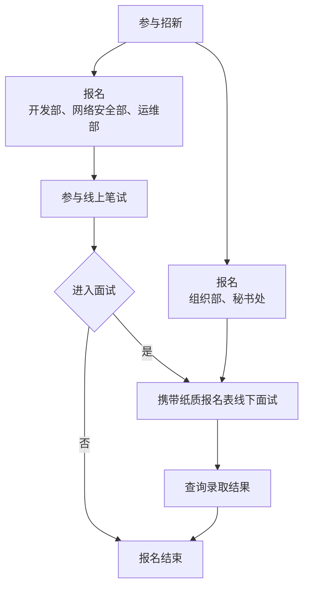

# 加入我们

> [!IMPORTANT]
> 2024年燕山大学大学生网络信息协会招新群群号为 837114441。最新招新动态将会在本群内发布，请大家关注群公告哦

招新流程图如下

## 笔试相关

> [!IMPORTANT]
> 2024年招新笔试系统已经于9月17日0点开放。共持续四天，大家可以在任意时间登录系统并提交答案。[笔试系统校园网内网网址](http://joinus.yuna.team) [外网网址](https://joinus-yuna-team.vpn.ysu.edu.cn:8118)

**每个部门都有相应的笔试题目**，你需要在规定时间内上传并提交你的解答。系统支持上传 PDF 和 Word 文档。提交文件的**文件名应只含有中英文，不应含有括号**。题目大部分为开放性问题，字数不限。你可以使用各种工具进行研究，但需要注意的是，**最终提交的文字内容不能由AI工具生成，并且必须注明所使用的参考资料来源**（例如链接、截图、照片、AI 工具等）。

请大家尽可能多角度、深层次地去分析题目给出的问题，力求回答的详细、透彻，并注意标明所选题目。

如有笔试系统相关问题，请加入招新群并向群主提问。
